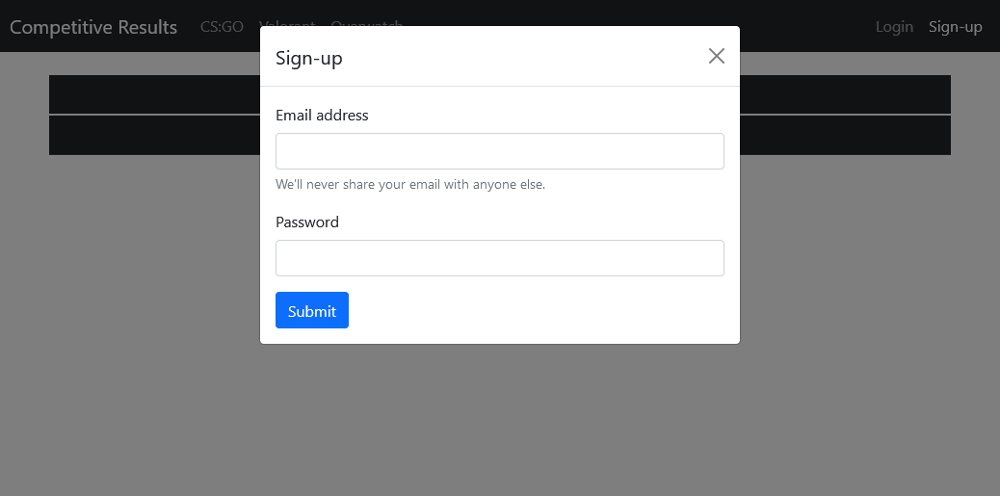
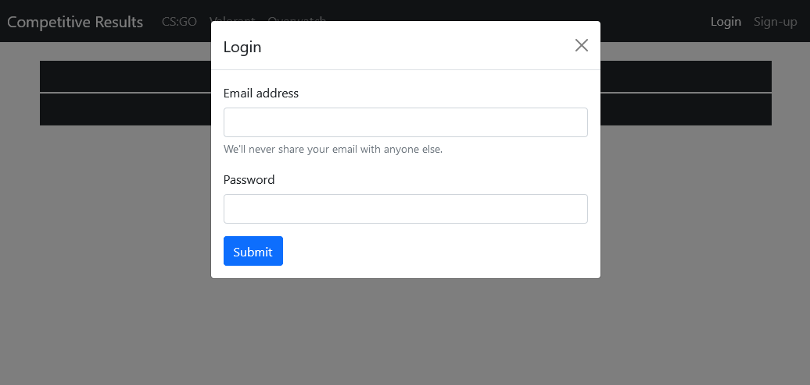
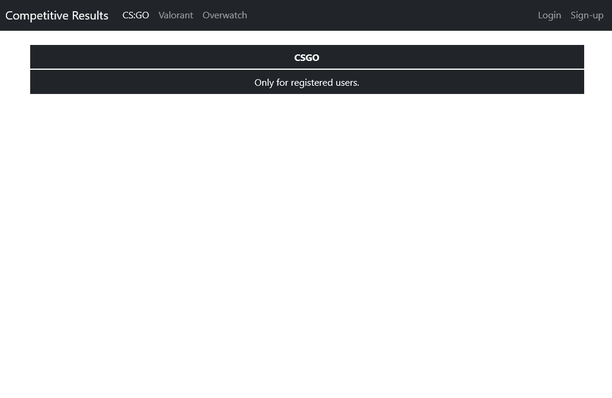
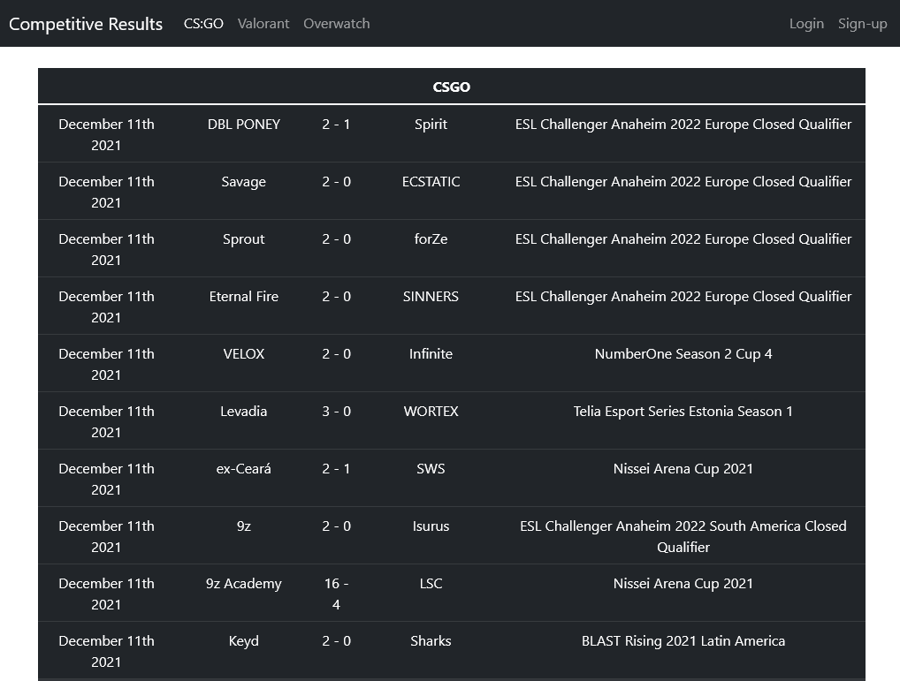

# Competitive Results
A Web App with a Login system to show data received from the Competitive Results API.

# Built with

## Frontend
- [Bootstrap 5.1.3](https://getbootstrap.com/)
- Vanilla JS

## Backend
- [Node.js](https://nodejs.org/en/)
- [Express.js](https://expressjs.com/)
- [jsonwebtoken](https://www.npmjs.com/package/jsonwebtoken)
- [bcrypt](https://www.npmjs.com/package/bcrypt)
- [nedb](https://www.npmjs.com/package/nedb)

# Getting started

## Pre-requisites
- [Competitive Results API](https://github.com/KevynSM/competitive-results-api)
- Install [Node.js](https://nodejs.org/en/)


## Installation
- Clone the repository

- Install dependencies
```
npm install
```
- Navigate to src folder
```
cd .\src\
```
- Run the project
```
node index.js
```
  Navigate to `http://localhost:8081`


# Screenshots
## Sign-up


## Login


## Without Login



## With Login


